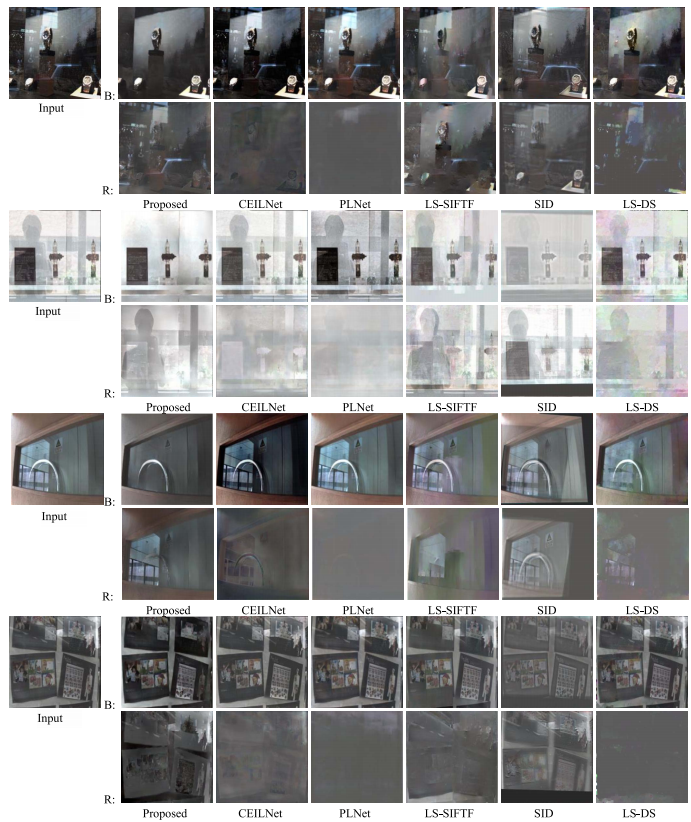

# MIRM
### Codes for the paper "Improved multiple-image-based reflection removal algorithm using deep neural networks" [[paper](https://drive.google.com/file/d/1d7e_2T23_BR5YIB32j53VdWktlM6-3N0/view?usp=sharing)] 

### Codes are implemented on Pytorch>=1.0 

## How to use

### Training:

Prepare the images with slight shifts (light filed images) into the './scenes_train' folder for reflection image synthesizing and training the networks. We only use **five** of each group of images ("3_3": the central one, "2_2": the top-left one, "2_4": the top-right one, "4_2": the bottom-left one, "4_4": the bottom-right one) to generate small npy patch for speeding up the training process. This is implemented by 

```
python npy_save_database_5views.py
```

All the npy files will be stored in the 'info_four_closest_corners_train_set'  folder (npy file path). Then

- Train the disparity network: 

```
python train_disparity.py
```

- Train the edge reconstruction network: 
```
python train_edge.py --train_label_dir (generated npy file path)
```
- Train the image reconstruction network: 
```
python train_img_rec.py --train_label_dir (generated npy file path)
```
### Inference and evaluation:

- We also provide the fine tuned <u>[pre-trained models](https://drive.google.com/file/d/1UmwgggXnpxeql4ZFi3Vq9Y_vgvMXyFxV/view?usp=sharing)</u> and the <u>[synthesized test data](https://drive.google.com/file/d/1Vd01fOlCEDiNXsi3_rmqviGTigFtgi0X/view?usp=sharing)</u> for evaluation. 
```
python image_separation.py --test_imgs_folder (test images path) ... --model_dir (model parameter path)
```
## Citation
T. Li, Y.-H. Chan, and D.P.K. Lun. "Improved multiple-image-based reflection removal algorithm using deep neural networks." IEEE Transactions on Image Processing, 2020.